# Database ERD

Generated from the live `fastapi_db` PostgreSQL schema on `2026-03-16`.

This Mermaid ERD is trimmed to key columns for readability:
- primary keys
- foreign keys
- a few descriptive business columns per table

```mermaid
erDiagram
  ALEMBIC_VERSION {
    string version_num PK
  }
  ATTENDANCES {
    int id PK
    int student_id FK
    int event_id FK
    int verified_by FK
    string status
    datetime time_in
    datetime time_out
  }
  BULK_IMPORT_ERRORS {
    int id PK
    string job_id FK
    int row_number
    text error_message
    json row_data
  }
  BULK_IMPORT_JOBS {
    string id PK
    int created_by_user_id FK
    int target_school_id FK
    string status
    string original_filename
    string stored_file_path
    string failed_report_path
  }
  DATA_GOVERNANCE_SETTINGS {
    int school_id PK
    int updated_by_user_id FK
    int attendance_retention_days
    int audit_log_retention_days
    int import_file_retention_days
    boolean auto_delete_enabled
  }
  DATA_REQUESTS {
    int id PK
    int school_id FK
    int requested_by_user_id FK
    int target_user_id FK
    int handled_by_user_id FK
    string status
    string request_type
  }
  DATA_RETENTION_RUN_LOGS {
    int id PK
    int school_id FK
    string status
    boolean dry_run
    text summary
  }
  DEPARTMENTS {
    int id PK
    int school_id FK
    string name
  }
  EMAIL_DELIVERY_LOGS {
    int id PK
    string job_id FK
    int user_id FK
    string email
    string status
    text error_message
    int retry_count
  }
  EVENT_DEPARTMENT_ASSOCIATION {
    int event_id PK
    int department_id PK
  }
  EVENT_PROGRAM_ASSOCIATION {
    int event_id PK
    int program_id PK
  }
  EVENTS {
    int id PK
    int school_id FK
    string name
    string status
    string location
    datetime start_datetime
    datetime end_datetime
  }
  GOVERNANCE_ANNOUNCEMENTS {
    int id PK
    int governance_unit_id FK
    int school_id FK
    int created_by_user_id FK
    int updated_by_user_id FK
    string title
    string status
  }
  GOVERNANCE_MEMBER_PERMISSIONS {
    int id PK
    int governance_member_id FK
    int permission_id FK
    int granted_by_user_id FK
  }
  GOVERNANCE_MEMBERS {
    int id PK
    int governance_unit_id FK
    int user_id FK
    int assigned_by_user_id FK
    string position_title
    boolean is_active
  }
  GOVERNANCE_PERMISSIONS {
    int id PK
    string permission_code
    string permission_name
    text description
  }
  GOVERNANCE_STUDENT_NOTES {
    int id PK
    int governance_unit_id FK
    int student_profile_id FK
    int school_id FK
    int created_by_user_id FK
    int updated_by_user_id FK
    json tags
  }
  GOVERNANCE_UNIT_PERMISSIONS {
    int id PK
    int governance_unit_id FK
    int permission_id FK
    int granted_by_user_id FK
  }
  GOVERNANCE_UNITS {
    int id PK
    int parent_unit_id FK
    int school_id FK
    int department_id FK
    int program_id FK
    int created_by_user_id FK
    string unit_name
  }
  LOGIN_HISTORY {
    int id PK
    int user_id FK
    int school_id FK
    string email_attempted
    boolean success
    string auth_method
    string failure_reason
  }
  MFA_CHALLENGES {
    string id PK
    int user_id FK
    string code_hash
    string channel
    int attempts
    string ip_address
    string user_agent
  }
  NOTIFICATION_LOGS {
    int id PK
    int school_id FK
    int user_id FK
    string status
    string category
    string channel
    string subject
  }
  PASSWORD_RESET_REQUESTS {
    int id PK
    int user_id FK
    int school_id FK
    int reviewed_by_user_id FK
    string status
    string requested_email
  }
  PROGRAM_DEPARTMENT_ASSOCIATION {
    int program_id PK
    int department_id PK
  }
  PROGRAMS {
    int id PK
    int school_id FK
    string name
  }
  ROLES {
    int id PK
    string name
  }
  SCHOOL_AUDIT_LOGS {
    int id PK
    int school_id FK
    int actor_user_id FK
    string status
    string action
    text details
  }
  SCHOOL_SETTINGS {
    int school_id PK
    int updated_by_user_id FK
    string primary_color
    string secondary_color
    string accent_color
  }
  SCHOOL_SUBSCRIPTION_REMINDERS {
    int id PK
    int school_id FK
    string status
    string reminder_type
    text error_message
  }
  SCHOOL_SUBSCRIPTION_SETTINGS {
    int school_id PK
    int updated_by_user_id FK
    string plan_name
    int user_limit
    int event_limit_monthly
    int import_limit_monthly
    datetime renewal_date
  }
  SCHOOLS {
    int id PK
    string name
    string school_name
    string school_code
    string address
    string logo_url
    string subscription_plan
  }
  STUDENT_PROFILES {
    int id PK
    int user_id FK
    int department_id FK
    int program_id FK
    int school_id FK
    string student_id
    int year_level
  }
  USER_FACE_PROFILES {
    int user_id PK
    string face_encoding
    string provider
    string reference_image_sha256
  }
  USER_NOTIFICATION_PREFERENCES {
    int user_id PK
    boolean email_enabled
    boolean sms_enabled
    string sms_number
    boolean notify_missed_events
    boolean notify_low_attendance
    boolean notify_account_security
  }
  USER_PRIVACY_CONSENTS {
    int id PK
    int user_id FK
    int school_id FK
    string consent_type
    boolean consent_granted
    string consent_version
    string source
  }
  USER_ROLES {
    int id PK
    int user_id FK
    int role_id FK
  }
  USER_SECURITY_SETTINGS {
    int user_id PK
    boolean mfa_enabled
    int trusted_device_days
  }
  USER_SESSIONS {
    string id PK
    int user_id FK
    string token_jti
    string ip_address
    string user_agent
  }
  USERS {
    int id PK
    int school_id FK
    string email
    string password_hash
    string first_name
    string middle_name
    string last_name
  }
  EVENTS ||--o{ ATTENDANCES : "event_id"
  STUDENT_PROFILES ||--o{ ATTENDANCES : "student_id"
  USERS ||--o{ ATTENDANCES : "verified_by"
  BULK_IMPORT_JOBS ||--o{ BULK_IMPORT_ERRORS : "job_id"
  USERS ||--o{ BULK_IMPORT_JOBS : "created_by_user_id"
  SCHOOLS ||--o{ BULK_IMPORT_JOBS : "target_school_id"
  SCHOOLS ||--o{ DATA_GOVERNANCE_SETTINGS : "school_id"
  USERS ||--o{ DATA_GOVERNANCE_SETTINGS : "updated_by_user_id"
  USERS ||--o{ DATA_REQUESTS : "handled_by_user_id"
  USERS ||--o{ DATA_REQUESTS : "requested_by_user_id"
  SCHOOLS ||--o{ DATA_REQUESTS : "school_id"
  USERS ||--o{ DATA_REQUESTS : "target_user_id"
  SCHOOLS ||--o{ DATA_RETENTION_RUN_LOGS : "school_id"
  SCHOOLS ||--o{ DEPARTMENTS : "school_id"
  BULK_IMPORT_JOBS ||--o{ EMAIL_DELIVERY_LOGS : "job_id"
  USERS ||--o{ EMAIL_DELIVERY_LOGS : "user_id"
  DEPARTMENTS ||--o{ EVENT_DEPARTMENT_ASSOCIATION : "department_id"
  EVENTS ||--o{ EVENT_DEPARTMENT_ASSOCIATION : "event_id"
  EVENTS ||--o{ EVENT_PROGRAM_ASSOCIATION : "event_id"
  PROGRAMS ||--o{ EVENT_PROGRAM_ASSOCIATION : "program_id"
  SCHOOLS ||--o{ EVENTS : "school_id"
  USERS ||--o{ GOVERNANCE_ANNOUNCEMENTS : "created_by_user_id"
  GOVERNANCE_UNITS ||--o{ GOVERNANCE_ANNOUNCEMENTS : "governance_unit_id"
  SCHOOLS ||--o{ GOVERNANCE_ANNOUNCEMENTS : "school_id"
  USERS ||--o{ GOVERNANCE_ANNOUNCEMENTS : "updated_by_user_id"
  GOVERNANCE_MEMBERS ||--o{ GOVERNANCE_MEMBER_PERMISSIONS : "governance_member_id"
  USERS ||--o{ GOVERNANCE_MEMBER_PERMISSIONS : "granted_by_user_id"
  GOVERNANCE_PERMISSIONS ||--o{ GOVERNANCE_MEMBER_PERMISSIONS : "permission_id"
  USERS ||--o{ GOVERNANCE_MEMBERS : "assigned_by_user_id"
  GOVERNANCE_UNITS ||--o{ GOVERNANCE_MEMBERS : "governance_unit_id"
  USERS ||--o{ GOVERNANCE_MEMBERS : "user_id"
  USERS ||--o{ GOVERNANCE_STUDENT_NOTES : "created_by_user_id"
  GOVERNANCE_UNITS ||--o{ GOVERNANCE_STUDENT_NOTES : "governance_unit_id"
  SCHOOLS ||--o{ GOVERNANCE_STUDENT_NOTES : "school_id"
  STUDENT_PROFILES ||--o{ GOVERNANCE_STUDENT_NOTES : "student_profile_id"
  USERS ||--o{ GOVERNANCE_STUDENT_NOTES : "updated_by_user_id"
  GOVERNANCE_UNITS ||--o{ GOVERNANCE_UNIT_PERMISSIONS : "governance_unit_id"
  USERS ||--o{ GOVERNANCE_UNIT_PERMISSIONS : "granted_by_user_id"
  GOVERNANCE_PERMISSIONS ||--o{ GOVERNANCE_UNIT_PERMISSIONS : "permission_id"
  USERS ||--o{ GOVERNANCE_UNITS : "created_by_user_id"
  DEPARTMENTS ||--o{ GOVERNANCE_UNITS : "department_id"
  GOVERNANCE_UNITS ||--o{ GOVERNANCE_UNITS : "parent_unit_id"
  PROGRAMS ||--o{ GOVERNANCE_UNITS : "program_id"
  SCHOOLS ||--o{ GOVERNANCE_UNITS : "school_id"
  SCHOOLS ||--o{ LOGIN_HISTORY : "school_id"
  USERS ||--o{ LOGIN_HISTORY : "user_id"
  USERS ||--o{ MFA_CHALLENGES : "user_id"
  SCHOOLS ||--o{ NOTIFICATION_LOGS : "school_id"
  USERS ||--o{ NOTIFICATION_LOGS : "user_id"
  USERS ||--o{ PASSWORD_RESET_REQUESTS : "reviewed_by_user_id"
  SCHOOLS ||--o{ PASSWORD_RESET_REQUESTS : "school_id"
  USERS ||--o{ PASSWORD_RESET_REQUESTS : "user_id"
  DEPARTMENTS ||--o{ PROGRAM_DEPARTMENT_ASSOCIATION : "department_id"
  PROGRAMS ||--o{ PROGRAM_DEPARTMENT_ASSOCIATION : "program_id"
  SCHOOLS ||--o{ PROGRAMS : "school_id"
  USERS ||--o{ SCHOOL_AUDIT_LOGS : "actor_user_id"
  SCHOOLS ||--o{ SCHOOL_AUDIT_LOGS : "school_id"
  SCHOOLS ||--o{ SCHOOL_SETTINGS : "school_id"
  USERS ||--o{ SCHOOL_SETTINGS : "updated_by_user_id"
  SCHOOLS ||--o{ SCHOOL_SUBSCRIPTION_REMINDERS : "school_id"
  SCHOOLS ||--o{ SCHOOL_SUBSCRIPTION_SETTINGS : "school_id"
  USERS ||--o{ SCHOOL_SUBSCRIPTION_SETTINGS : "updated_by_user_id"
  SCHOOLS ||--o{ STUDENT_PROFILES : "school_id"
  DEPARTMENTS ||--o{ STUDENT_PROFILES : "department_id"
  PROGRAMS ||--o{ STUDENT_PROFILES : "program_id"
  USERS ||--o{ STUDENT_PROFILES : "user_id"
  USERS ||--o{ USER_FACE_PROFILES : "user_id"
  USERS ||--o{ USER_NOTIFICATION_PREFERENCES : "user_id"
  SCHOOLS ||--o{ USER_PRIVACY_CONSENTS : "school_id"
  USERS ||--o{ USER_PRIVACY_CONSENTS : "user_id"
  ROLES ||--o{ USER_ROLES : "role_id"
  USERS ||--o{ USER_ROLES : "user_id"
  USERS ||--o{ USER_SECURITY_SETTINGS : "user_id"
  USERS ||--o{ USER_SESSIONS : "user_id"
  SCHOOLS ||--o{ USERS : "school_id"
```

## Notes

- `governance_units.parent_unit_id` is a self-reference that models the SSG -> SG -> ORG hierarchy.
- `program_department_association`, `event_department_association`, and `event_program_association` act as join tables.
- `alembic_version` is included in the schema inventory but omitted from relationships because it is migration metadata only.
