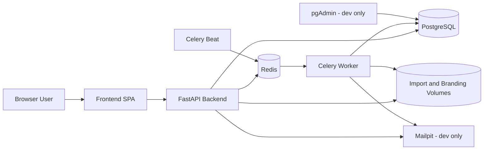

# System Architecture

> **Status:** Maintained
> **Last Updated:** 2026-03-28
>
> **Source of truth:**
> - `docker-compose.yml`
> - `docker-compose.prod.yml`
> - `Backend/app/main.py`
> - `Backend/app/workers/celery_app.py`
> - `Frontend/src/App.tsx`
> - `Frontend/nginx.prod.conf`

---

## Architecture Summary

VALID8 is a containerized web application built as a modular monolith with supporting background services.

- The frontend is a React single-page application.
- The backend is a FastAPI application that owns API, auth, business rules, and DB access.
- Background and scheduled work runs through Celery.
- PostgreSQL stores application data.
- Redis is used as the Celery broker and result backend.
- Mailpit and pgAdmin are development support services.

This is not a set of independently deployed business microservices. The business domains live inside one backend codebase, with worker processes handling long-running or scheduled tasks.

See also:
- [backend-structure.md](./backend-structure.md)
- [frontend-structure.md](./frontend-structure.md)
- [api-overview.md](../api/api-overview.md)
- [database-overview.md](../database/database-overview.md)
- [functional-requirements.md](../../requirements/functional-requirements.md)

## Runtime Topology



## Service Inventory

| Service | Development runtime | Production runtime | Responsibility |
|---|---|---|---|
| `frontend` | Vite dev server on port `5173` | Built assets served by Nginx on port `80` | Browser UI, routing, data presentation |
| `backend` | FastAPI on port `8000` | FastAPI on internal port `8000` behind the frontend reverse-proxy path | REST API, auth, business logic |
| `worker` | Celery worker process | Celery worker process | Async jobs such as imports, emails, and security notifications |
| `beat` | Celery beat scheduler | Celery beat scheduler | Periodic jobs such as event workflow sync |
| `db` | PostgreSQL 15 on host port `5433` | PostgreSQL 15 on host port `5432` | Persistent relational data |
| `redis` | Redis 7 on port `6379` | Redis 7 on port `6379` | Celery broker and result backend |
| `mailpit` | Present on ports `1025` and `8025` | Not defined in prod compose | Local SMTP capture for testing emails |
| `pgadmin` | Present on port `5050` | Not defined in prod compose | DB inspection during development |

In production, `Frontend/nginx.prod.conf` proxies `/api/`, `/token`, `/openapi.json`, `/docs`, `/redoc`, and `/media/school-logos/` to the backend service.

## Main Interaction Flows

### 1. Synchronous request flow

```text
Browser
-> React route and page
-> frontend API module
-> FastAPI router
-> service and DB logic
-> JSON response
-> UI update
```

### 2. Background job flow

```text
Frontend action
-> FastAPI endpoint
-> Celery task registration
-> Redis broker
-> worker or beat process
-> DB or email side effect
-> frontend reads job outcome through standard API calls
```

### 3. Auth and access-control flow

```text
Login request
-> backend auth router
-> JWT and session handling
-> frontend protected routes
-> role and governance-based access checks
```

## Key Design Decisions

| Decision | Reason |
|---|---|
| School-scoped multi-tenancy | Keeps data separated by school while staying manageable inside one application database. |
| JWT plus server-side session tracking | Supports normal API auth plus explicit session control and revocation. |
| Celery with Redis | Moves long-running work out of the request path and supports scheduled event-sync jobs. |
| Face-recognition attendance support | Aligns the implemented attendance flow with project scope and current frontend/backend modules. |
| Governance-aware route and permission model | Supports SSG, SG, and ORG workflows without splitting the app into separate products. |

## Code and Requirement Traceability

| Architecture concern | Code or doc anchor |
|---|---|
| Container topology | `docker-compose.yml`, `docker-compose.prod.yml` |
| Backend entry and router wiring | `Backend/app/main.py` |
| Background processing | `Backend/app/workers/celery_app.py`, `Backend/app/workers/tasks.py` |
| Frontend route map | `Frontend/src/App.tsx` |
| API contract | [endpoints.md](../api/endpoints.md), [request-response.md](../api/request-response.md) |
| Data model | [ERDv2.md](../ERD/ERDv2.md), [relationships.md](../database/relationships.md) |
| Functional scope | [functional-requirements.md](../../requirements/functional-requirements.md), [use-cases.md](../../requirements/use-cases.md) |

## Documentation Controls

- If a service, port, dependency, or runtime path changes, update this page in the same change set.
- Diagrams must match the compose files and active runtime code. Do not keep speculative containers or outdated labels.
- When architecture behavior changes, verify linked API, database, and requirements docs at the same time.
