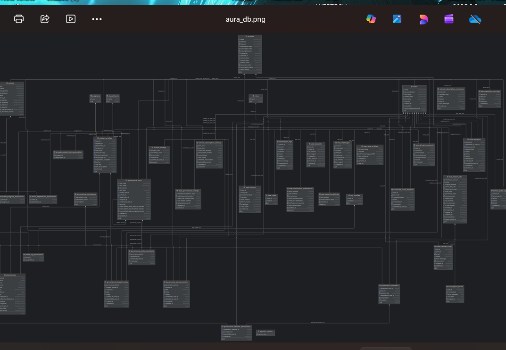

# Database ERD (v2)

> **Status:** Maintained
> **Last Updated:** 2026-03-28
>
> **Source of truth:**
> - `Backend/app/models/`
> - `Backend/alembic/versions/`
> - `docs/technical/database/`

---

## Purpose

This document is the authoritative ERD visual index for the current AURA_PUBLICFACE database structure.

It is designed to prevent:

- outdated or inaccurate diagrams
- unclear ERD versioning
- missing context for relationships
- mismatch between diagram and active schema

Need help reading the diagrams? See [ERDGuide.md](./ERDGuide.md).

## Diagram Version Map

| Diagram asset | Version label | Scope | Current usage |
|---|---|---|---|
| `aura_db.png` | `ERD-v2-main` | Full active core schema | Primary reference for architecture, backend, and review. |
| `desktop_erd.png` | `ERD-v2-desktop-capture` | Snapshot export of v2 schema | Supplemental visual for presentations. |
| `ai_logs.png` | `ERD-legacy-analytics` | Historical analytics and AI/log tables | Historical context only, not active schema baseline. |

## Main Schema (Authoritative)

## Supplemental Desktop Capture

## Historical Analytics Diagram (Legacy)

Legacy note:

- Active schema cleanup migrations remove several analytics legacy tables (for example `ai_logs`, `anomaly_logs`, `attendance_predictions`, `event_predictions`, `event_flags`).
- Use this image for historical explanation only, not for active table definitions.

## Active Schema Traceability

| Traceability item | Current value |
|---|---|
| Active model table objects | 38 (including association tables) |
| Active Alembic head | `b1a2c3d4e5f6` |
| Active relationship source doc | [relationships.md](../database/relationships.md) |
| Active table dictionary | [tables.md](../database/tables.md) |
| Active migration log | [migrations.md](../database/migrations.md) |

## Relationship Validation Rules

- Relationships shown as active in ERD documentation must exist in current models or active migration head.
- Removed legacy entities must be labeled as historical and excluded from active relationship explanation.
- Many-to-many links should be validated through explicit junction tables:
  - `event_department_association`
  - `event_program_association`
  - `program_department_association`

## Update and Review Checklist

When schema changes occur:

1. Update migrations and verify head revision.
2. Revalidate ERD visuals against active tables and relationships.
3. Update this file's version map or labels if diagram assets changed.
4. Update [ERDGuide.md](./ERDGuide.md) if reading guidance changed.
5. Update database docs in `docs/technical/database/` in the same change set.

## Related Docs

- [ERDGuide.md](./ERDGuide.md)
- [database-overview.md](../database/database-overview.md)
- [tables.md](../database/tables.md)
- [relationships.md](../database/relationships.md)
- [migrations.md](../database/migrations.md)
